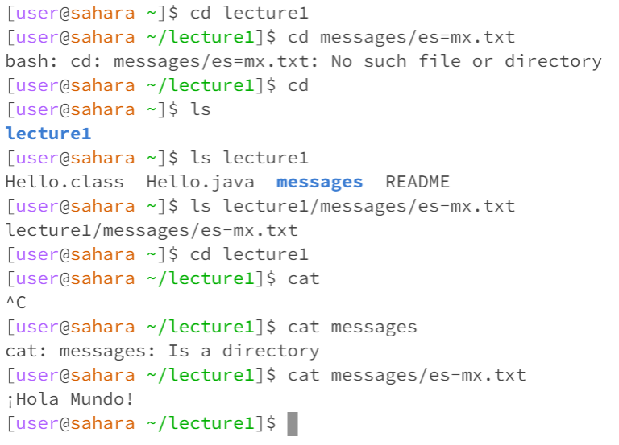

1. `cd` without argument
* When `cd` is used without a command it changes the directory back to Home if it's in another directory
* Not an error as it just changes back to home

2. `cd` with a path to a directory as an argument
*
